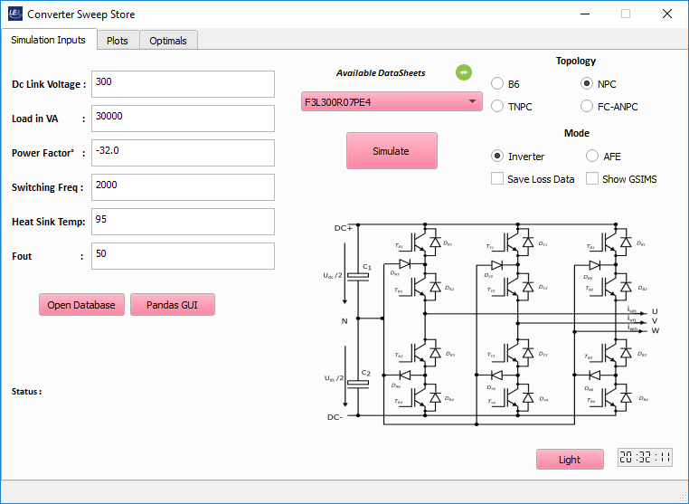
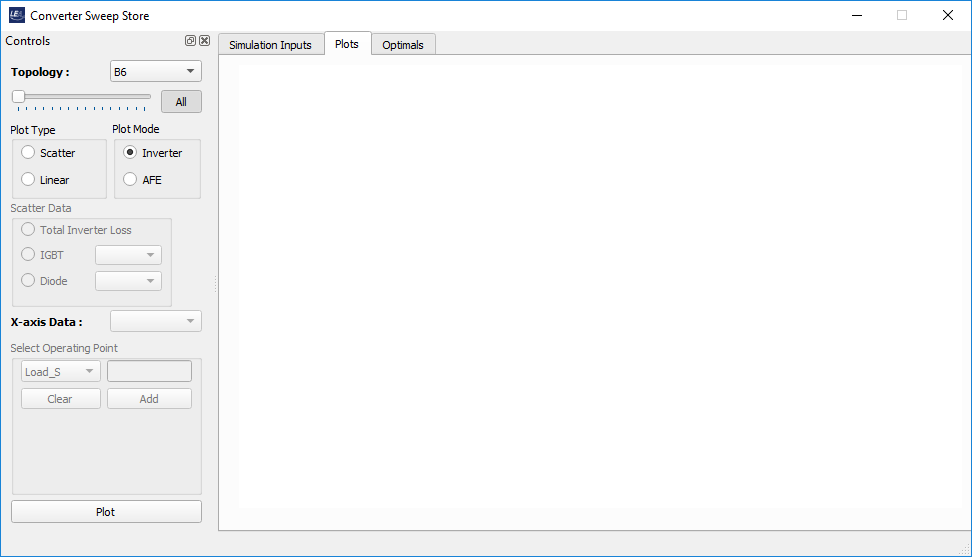
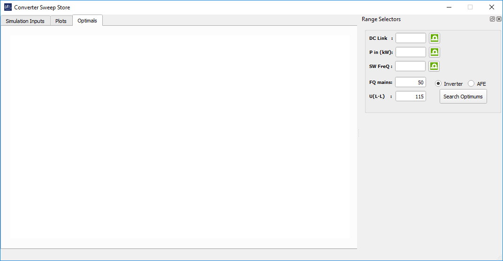

# Converter Sweep Store
## Table of contents
* [General info](#general-info)
* [Topologies included](#topologies-included)
* [Installation](#installation)
* [Usage](#usage)
* [Screenshots](#screenshots)
* [Technologies](#technologies)
* [Start](#start)
* [Debug](#Debug)
* [Features](#features)
* [Status](#status)
* [Inspiration](#inspiration)

## General info
This application is being developed to achieve one of the main tasks of the Master thesis titled 'Comparision of Converter Topologies for Ups Systems'.
As the title suggests, the main objective of this thesis is to compare the different converter topolgies for designing the UPS systems. The comparisions
are based on the converter losses generated at different boundary conditions. GeckoCIRCUITS is used as simulation tool for estimating the power losses
generated during converter operation. GeckoCIRCUITS provides the user with a set of easy-to-understand  and straight forward to use scripting functions.
During initial stage, simulations were carried out using python scripts communicating through network port of the GeckoCIRCUITS.<p> However, it involved many manual
edits of the scripts and required control of the loss data obtained after every simulation. To eliminate such lengthy scripts and to ease the process of recording
the loss information in form of Look Up Tables(LUT) is the motivation that led to the development of this application. Not only performing simulations and recording losses, comparitive study between 4 included converter topologies is carried out using this application.

## Topologies included
1. 2-Level B6 topology
2. 3-Level NPC topology
3. 3-Level TNPC topology
4. 5-Level FC based ANPC topology

## Installation
```
cd /Documents/Folder/of/Interest   
git clone git@github.com:upb-lea/PyGeckoCircuits.git
```
or 
```
Download the 'Converter Sweep Store'.exe installation file (will be release soon)
```

## Usage
Using this application parametric sweeps can be performed and comapritive study is carried out. The application features 3 main tabs and are described below:<br/>
**Simulation Tab**: Simulations are carried out using in this tab. Houses necessary input controls for providing the required opearting point 
and controls to change the mode of operation and save loss information.<br/>
**Plots Tab**: In this tab, loss characteristics of the particular topology are studied using matlabplotlib plotting features. Houses controls to
view the loss information based on the different combination of operating parameters.<br/>
**Optimals Tab** : This tab features enables the comparitve study of different converter topologies. Controls are mainly range selectors enabling the 
user to choose flexible opeating points. <br/>
_Note_ : line to line voltage(U<sub>L-L</sub>) = 115V, fundamental frequency (F<sub>out</sub>) = 50 Hz are hardcorded to meet the thesis requirements.

## Screenshots
<p float="left">



</p>

## Technologies
Project is created with:
* PyQt5
* Python 3.6/7
* Matplotlib
* Pandas 1.2.*

## Start
To run this application, it is necessary first to set up the GeckoCIRCUITS which in turn requires java version 1.8 installation. Once java is installed 
GeckoCIRCUITS is opened and tested if everything works perfectly. Application internally points to .jar location of the GeckoCIRCUITS inside the folder.
And so it is atmost important to place the GeckoCIRCUITS folder in the application search path. Also the application uses converter model (.ipes) files
for perfoming the simulations. These can be found inside the 'PythonGecko' folder under 'InverterModels'.
The relative path of every folder is as follows:<br/>
_----Parent Folder------_<br/>
 +_GeckoCIRCUITS_+<br/>
 +_ComponentSCLs_+<br/>
 +_CSweep Store_+<br/>
 +_Thermal_+<br/>
 **_GeckoCIRCUITS_** : Folder is intially empty and hence it is advised to download the GeckoCIRCUITS from wikepedia page. The empty folder should be then replaced 
with the downloaded folder.<br/>
 **_ComponentSCLs_** : This folder holds the .scl files which will used by the GeckoCIRCUITS tool to load the characteristic curves into every switch of the converter.<br/>
 **_CSweep Store_**  : Folder where the main application .exe file resides along with other required dependancies.<br/>
 **_Thermal_**       : It contains two .CSV files 'DatasheetDB.csv' and 'params.csv' which relates the .scl file thermal parameters and switch relations which constitue a datasheet.
 <p>Failure to maintain this order results in the application not finding required model files, component .SCL files or failure to start the GeckoCIRCUITS.
Currently only 4 Datasheets are created and added to the application. User can created more by him\herself's from the manufacturers datasheet switch
characteristic curves. From which the .scl files and required thermal parameters are extracted and mapped to each other using 'AddToTransistorDB.py'
present inside Thermal folder.

## Debug
To create a debbugging environment proceed with following steps.
1. Clone the repository.
2. Make sure that GeckoCIRCUITS main window can be opened which ensures successful installation of java environment (jdk1.8.0_281 or higher).
3. Ensure the folder path locations as specified. 
4. Use Visual studio 2019 or similar python IDE's to run in developer mode.

## Features
This project is developed as part of Master thesis work.
List of features ready and TODOs for future development
* Parametric simulations to be carried out on 4 topologies included
* Comparisons performed using plotting features of matplotlob library within and between different topologies
* A Database holding the simulation information and loss information extracted after every simulation in form of pickle format
* Simulations of both Inverter Mode and Active Front End mode of operation are made possible 
* Optimal Controls to select flexbile boundary conditons.
To-do list:
* A possibilty to establish connection with the LEA transistor database can serve a good future scope of the application.

## Status
Project is: _Testing Phase_

## Inspiration
The application is an automated tool to carry out steady state simulations, store the results and make comparison for choosing a particular 
converter or well suitable operating for particular converter before going for hardware construction.
Though these simulation can be done manually or using scripting functions but still a user friendly GUI can ease work and prove benefical to 
the user looking to work in this area.<p>Thankful to Mr. Nikolas Förster for believing in me, supporting and guiding me through out the thesis work.

Created by @MohanNagella - feel free to contact me!

## Bug Reports
Please use the issues report button within github to report bugs.

## Changelog
Find the changelog [here](CHANGELOG.md)
